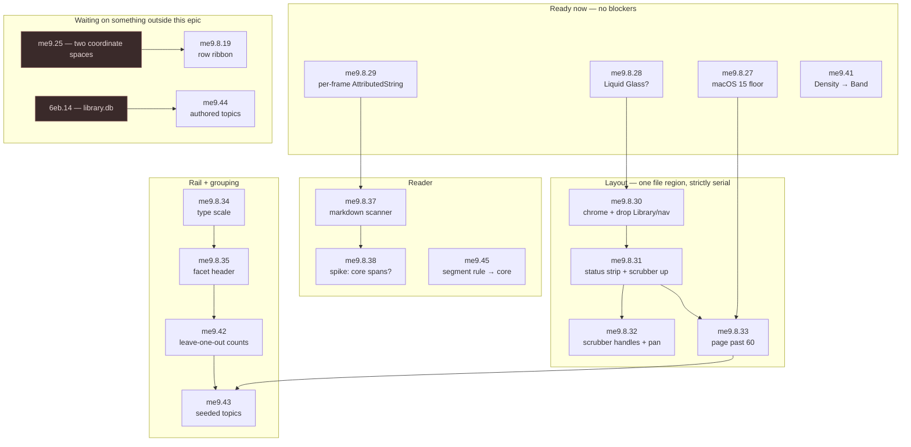

# The macOS app: what is built, and what is next

`chat-search-me9.8`, the deep surface over `cs-core`.

**Status lives in beads, not here.** This file holds what a task list cannot: the phases the work
fell into and why, the edges between the remaining beads and the reasons behind them, and which
files force two beads apart. Titles and priorities rot; reasons do not. For the live picture:

```bash
bd list --parent chat-search-me9.8      # everything, open and closed
bd ready                                 # what is actionable right now
bd dep tree chat-search-me9.8.33         # why one bead is waiting
```

[README.md](./README.md) is the implementation record — how each piece works and what it
measured. This is the map above it.

---

## Built

Beads closed between 2026-07-29 and 2026-08-06, in five groups. They are groups rather than
sprints: the epic's one hard ordering rule is that **the shell lands before anything fans out**,
because "five agents told to build the app produce five incompatible skeletons — window, client
state, transport and error handling all invented independently."

The count that used to open this paragraph is gone rather than corrected. `bd list --parent
chat-search-me9.8` has it, and a number maintained by hand beside a live one is a number that is
wrong the first time somebody forgets.

**1 · The shell.** `me9.8.1` promoted the `me9.22` spike rather than starting from a blank page,
which is where the transport's threading fix came from — readability handlers instead of
`waitUntilExit`, worth 85 ms to 30 ms p50, because the old shape parked three threads per
invocation and exhausted `DispatchQueue.global` at four keystrokes in flight. `me9.8.7` fixed a
decoder still reading the retired envelope.

**2 · The panes.** The result row at real data (`me9.8.2`), the folded reader (`me9.8.3`), facets
and opening a conversation where it lives (`me9.8.5`), grouping and Library (`me9.8.4`), and the
fold plus the keyboard that had to come with it (`me9.8.15`).

**3 · The theme seam.** Deliberately before the views that would have hardcoded it (`me9.8.8`),
then several directions in one binary (`me9.8.9`), the decision about whether a named theme may
fail the fenced measurements (`me9.8.12`), Gruvbox and Solarized ported on those terms
(`me9.8.17`), appearance and direction split into two axes (`me9.8.22`), and a settings window
(`me9.8.21`), and a token set read off a file at launch (`me9.8.10`). The seam holds: switching
is one `.environment(\.theme, theme)` at the root, six directions come out of one binary with
nothing under `Sources/ChatSearch` differing between them, and the seventh does not have to be in
the binary at all.

**4 · The instruments.** The minimap and its scroll relationship (`me9.8.18`), the bottom drawer's
timeline and scrubber (`me9.8.20`), the main menu (`me9.8.24`), a `dir:` parsing bug (`me9.8.16`),
and the drawer's key (`me9.8.26`) — which is the menu paying for itself: `me9.8.20` had closed
saying a window with one focused view has no key to spare, and a menu bar is where that stops
being true. The axis followed it there (`me9.8.40`), which is the same rent paid a second time: the
four chips were a click and nothing else, and `View ▸ Group` at ⌘1–⌘4 is what a four-state control
looks like once there is a bar to put it on.

**5 · The reader's controls.** The per-frame `AttributedString` first (`me9.8.29`), because the
next thing was going to add runs to that path, then the fidelity model itself (`me9.8.36`): four
knobs over `Band`, three levels, four presets, and a run summarised in one line rather than listed.
A port of `poc/ui`'s fifth iteration of that control and not a design — and the reason the ordering
matters is that `me9.41` had to re-key `Density` onto `Band` first, since `{ user: expanded, agent:
collapsed }` is unsayable in a table keyed on `kind` where both are `prose`.

---

## Next

Five beads in the graph are children of **`chat-search-me9` (Clients)** rather than of this epic,
because they change `cs-core` or the wire rather than the app: `me9.41`, `me9.42`, `me9.43`,
`me9.44`, `me9.45`. `bd list --parent chat-search-me9.8` will not show them.

The graph carries closed beads it should not — `me9.8.41` is the sweep, and it is filed rather than
done here because a node drawn as pending work is the kind of error that spreads while it is being
corrected one edge at a time.



Kept out of the graph to keep it readable. Free-standing — nothing blocks them and they block
nothing: `me9.8.6` (prove the seam by swapping a whole theme), `me9.8.11` (is spacing outside the
row a token), `me9.8.14` (carry `model` and `thread_count` on the wire), `me9.8.23` (a group head
counts rows in hand and cannot say what the corpus holds), `me9.8.25` (`cs timeline` cannot
describe a `--tools` search). And one pair: `me9.8.13` (a hue for `google-takeout`, or a rule for
sources the palette does not name) blocks `g6u` (the facet rail has no source colour).

### Why the edges are there

Most of them are not "this needs that to exist." They are two beads reaching for the same file, or
one bead making the next one cheap.

| edge | reason |
| --- | --- |
| `28 → 30` | No point theming a titlebar before knowing whether the macOS 26 SDK is already compositing glass over it. |
| `30 → 31` | Both rewrite the top of `Shell.swift`. Remove and reclaim height, *then* add two strips into it. |
| `31 → 32` | Build the scrubber's gestures once, after it has moved. |
| `27 → 33` | Was "`ScrollPosition` is how a list keeps its place when a page is appended rather than jumping", and `27` measured that `ScrollPosition` does not move a `List` at all — see [what the floor bought](./README.md#what-the-floor-bought). What survives the edge is `onScrollGeometryChange`: `33` still needs to know where the list is to know it has reached the bottom, and it needs another answer for keeping its place. |
| `10 → 34` | Without a token set read at runtime, the type scale is one rebuild per guess. |
| `34 → 35` | Guessed the header might stop colliding once `micro` was 10pt with less tracking. It did not — 10pt is *wider* than 9 and `34` never touched tracking — so `35` did the whole of it. |
| `29 → 36`, `29 → 37` | Both add runs to a path that currently rebuilds an `AttributedString` on every body evaluation. Fix it first or measure the wrong thing. |
| `41 → 36` | `Density::default_fold` keys on `kind`, so it cannot express `user: expanded, agent: collapsed` — both are `prose`. |
| `36 → 45` | The port computes segments client-side deliberately; the core rule then re-points it. |
| `34 → 35` | The header may stop colliding once `micro` is 10pt with less tracking — see what is left first. |
| `29 → 36`, `29 → 37` | Both add runs to a path that currently rebuilds an `AttributedString` on every body evaluation. Fix it first or measure the wrong thing. |
| `41 → 36` | `Density::default_fold` keys on `kind`, so it cannot express `user: expanded, agent: collapsed` — both are `prose`. |
| `36 → 45` | The port computes segments client-side deliberately; the core rule then re-points it. |
| `34 → 35` | The header may stop colliding once `micro` is 10pt with less tracking — see what is left first. |
| `29 → 37` | It adds runs to a path that used to rebuild an `AttributedString` on every body evaluation. Fix it first or measure the wrong thing — the same edge `me9.8.36` was held behind. |
| `35 → 42 → 43` | All three edit `Rail.swift`. |
| `33 → 43` | Both edit `Grouping.swift`. |

### The conflict map

The reason to care about serialisation here is parallel dispatch into worktrees. These are the
files two or more open beads want:

| file | beads |
| --- | --- |
| `Shell.swift`, `SearchView.swift` top | `me9.8.30`, `me9.8.31` |
| `SearchView.swift` list, `Grouping.swift` | `me9.8.33`, `me9.43` |
| `ReaderView.swift`, `BlockRow` | `me9.8.37` — and `me9.45`, which replaces `Segments.swift` under it |
| `Rail.swift` | `me9.8.35`, `me9.42`, `me9.43` |
| `cs-core/src/blocks.rs` | `me9.41`, `me9.45`, `qyn` |
| `poc/ui/tokens.py`, `Tokens.swift` | `me9.8.34` |

### Waiting on other epics

- **`me9.25`** — `match_seqs` and `kind_runs` are two coordinate spaces, so a client cannot draw
  both on one strip. Blocks the row ribbon. `me9.23` and `me9.26` have since closed, so the
  prototype ribbon now exists and the shape is close to free to ask for; only the coordinate
  question is left. Worth checking whether `me9.45` simplifies it, since one run function feeding
  both the strip and the reader is one coordinate space by construction.
- **`6eb.14`** — `library.db` and the authored event log. Blocks authored topic collections, and is
  needed by `6eb.15` and `6eb.25` regardless.

---

## Two rules that changed on 2026-08-06

**The app leads; `poc/ui` is a scratchpad.** This epic used to say "open it and build what it
shows," with an authority order of measurement, then a deviation in a child bead, then the mockup.
That assumed a mockup ahead of the app, and it no longer is. A no-op `swift build` is 0.11s, one
changed view file about 1s, the whole `ChatSearch` module from cold 39s — against a headless
harness (`--shot`, `--measure`, `--size`, `--theme`, `--appearance`, `--group`, `--folded`,
`--settings`, `--longest`) that closes the loop without a person. `poc/ui` runs off a static export
with **no ranking at all**, so paging, query-following facet counts, scroll behaviour and latency
are all structurally untestable there. Where they disagree, the app is right and the prototype is
stale. What it still holds is the reasoning in `NOTES.md` and its own comments — which is why it is
kept rather than deleted.

**Derived is disposable; authored is forever.** The split that decides where a feature is allowed
to store anything. A seeded topic is a pure function of (archive, seed list in code, importer
version), so it is a legitimate `index.db` column and `rm index.db && cs index` regenerates it —
which is what makes `me9.43` free to throw away and replace. A topic somebody *named* is authored,
belongs in `library.db`, and needs migrations and sync forever — which is what makes `me9.44` a
later and more careful decision. ADR 16 keeps both safe by forbidding a topic from ever entering an
id.
