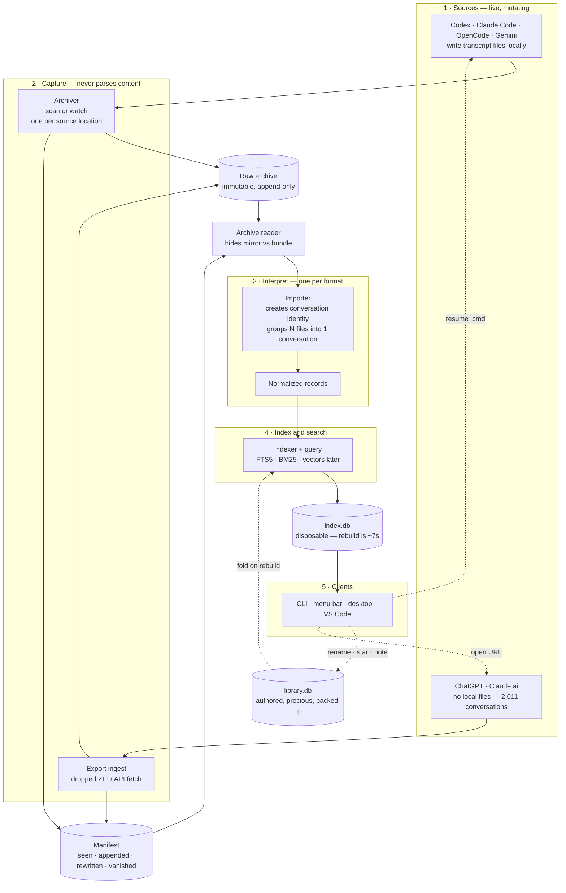
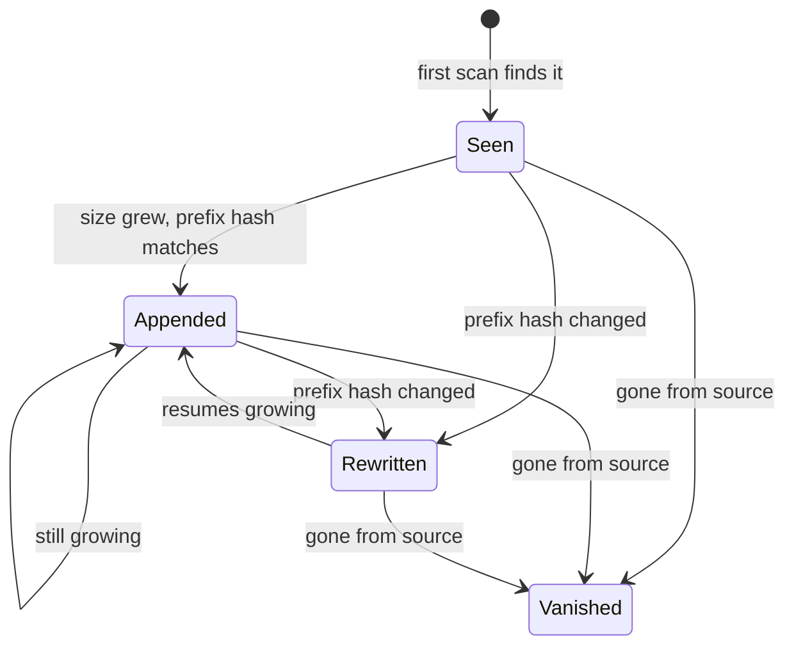

# Architecture (draft)

> **Status: draft, in flux.** A working sketch of how the pieces fit, kept around so the
> shape is easy to discuss and easy to onboard to. It is _derived_ from the decision log,
> the way `index.db` is derived from the archive — rebuildable, and not the source of truth.
>
> **If you are an agent or a future reader:** where this disagrees with
> [DECISIONS.md](./DECISIONS.md) or [GLOSSARY.md](./GLOSSARY.md), **those win.** Much of what
> is drawn here is ADR status `proposed`, not `accepted`. Almost nothing here is built yet —
> see [Current state](#current-state) before assuming any of it exists.
>
> Last synced with the decision log: 2026-07-28.

---

## The flow

The two dotted loops are the part that is easy to miss: **authored data flows back** into the
index on every rebuild, and **`resume_cmd` flows back** to the originating tool. Everything
else is a straight line.

---

## Components

| | Knows about | Must not know | If it fails | One per |
| --- | --- | --- | --- | --- |
| **Archiver** | paths, sizes, mtimes, hashes, layout policy | JSON structure, what a conversation is | **permanent data loss** | source _location_ |
| **Archive reader** | physical layout (mirror vs bundle) | formats, conversations | rebuild breaks | archive |
| **Importer** | one source's format, lineage, kinds | where bytes came from, machines, capture history | no search — rerun in 7s | source _format_ |
| **Indexer + query** | schema, tokenizer, ranking | source formats | no search — rerun in 7s | project |
| **Clients** | the query contract | everything upstream | no UI | surface |

Two boundaries carry most of the weight:

- **Archiver / importer** — the split that makes _retroactive reparse_ possible. Fix an
  importer, rebuild, and every conversation back to the first captured byte gets the
  improvement. Fused, fixes would only ever apply going forward. (ADR 1)
- **Indexer / search are NOT split.** They share the tokenizer, schema and ranking; splitting
  them produces silent recall bugs rather than crashes.

---

## Why "one chat" is not "one file"

A single Codex conversation from this corpus produced four files, hours apart, each with a
different UUID in its filename:

| file | role | size |
| --- | --- | --- |
| `rollout-…019f199a…` | main thread | 2,961 KB |
| `rollout-…019f1a51-b486…` | subagent (Averroes) | 768 KB |
| `rollout-…019f1a51-cab4…` | subagent (Poincare) | 465 KB |
| `rollout-…019f1ace…` | subagent (Singer) | 239 KB |

Nothing in the filenames or paths links them — the shared `session_id` is _inside_ the files.
So the archiver cannot group them and does not try; it copies four unrelated files.

**Conversation identity does not exist until stage 3.** This is the clearest illustration of
the division of labour, and the reason the archiver can be finished before any importer works.

---

## File lifecycle

What the archiver records in the manifest for each source file:

- **Appended** is the overwhelmingly common case — copy the newer, longer file over the older
  one. Monotonic, so nothing is lost.
- **Rewritten** means compaction or an in-place edit — preserve the old copy under
  `_superseded/` rather than losing it.
- **Vanished** folds up into `conversation.deleted_upstream_at`. The content is kept; only the
  fact that it is gone upstream is recorded. (ADR 9)

A file being written _while_ the archiver copies it yields a truncated last line. That is safe
by construction, not by luck: append-only plus supersede-on-next-scan means the partial copy
is replaced. Importers skip unparseable trailing lines.

---

## Cadence and lag

The stages do not run together, so there is always some lag between saying something and
being able to search for it.

| stage | runs |
| --- | --- |
| source writes | continuously, during the conversation |
| archiver | scheduled scan; watch for the live session (undecided) |
| importer + indexer | on rebuild (~7s), or tail-append for the live session |
| clients | on demand |

How much lag is acceptable is a UX decision that drives the watch-vs-scan choice. It is not
settled.

---

## Current state

Almost nothing here is built. Honest inventory:

| | state |
| --- | --- |
| Archiver | **built** — mirror layout, clone capture, change detection. Bundle layout (OpenCode) not implemented |
| Manifest | **built** — append-only JSONL, folded on load |
| Archive reader | **not built** |
| Importers — Codex, Claude Code | PoC only, and they read **live source dirs, not the archive** |
| Importers — OpenCode, Gemini, ChatGPT export | **not built** |
| Indexer + BM25 search | PoC only — flat messages, no DAG, no `head_id`, no tombstones |
| Embeddings / vectors | **not built** |
| `library.db` and authored events | **not built** |
| Clients | **not built** (PoC has a JSON-emitting CLI) |

What exists is `poc/` — the same program written in TypeScript and Rust to settle the
language question ([RESULTS.md](../poc/RESULTS.md)). It is a measurement instrument, not a
foundation. Language is now settled as Rust (ADR 13).

---

## Open questions that would redraw this

| # | question | affects |
| --- | --- | --- |
| ADR 16 | Is `codex_work_desktop` a separate source? Cannot be retrofitted — it changes conversation ids | source list, archive layout |
| ADR 17 | Machine re-keying after a clone or restore | archive namespacing |
| ADR 18 | Sync raw at all, or keep per-machine archives and merge only `library.db`? | whether the archive is a sync unit |
| ADR 19 | Prefix hash vs full-file hash | scan cost, rewrite detection |
| ADR 20 | Archive storage — 17 GB free, ~1 GB/month growth. Leaning APFS clone (measured ~free), compression deferred | capture strategy; clone vs compress is exclusive per copy |
| ADR 14 | Subprocess vs daemon | whether clients talk to a process or a binary |
| ADR 15 | Redact at capture or at display | whether the archiver is destructive |
| — | Watch vs scan, and acceptable lag | archiver design |

---

## Reading order

1. [GLOSSARY.md](./GLOSSARY.md) — vocabulary. Four different things look like "branching"; they are not interchangeable.
2. [DECISIONS.md](./DECISIONS.md) — what was decided and why, with status.
3. [../poc/RESULTS.md](../poc/RESULTS.md) — measurements, and the three bugs differential testing caught.
4. This document — the shape it all adds up to, provisionally.
5. [BACKLOG.md](./BACKLOG.md) — deferred work, cross-referenced to the ADR that justifies each item.
