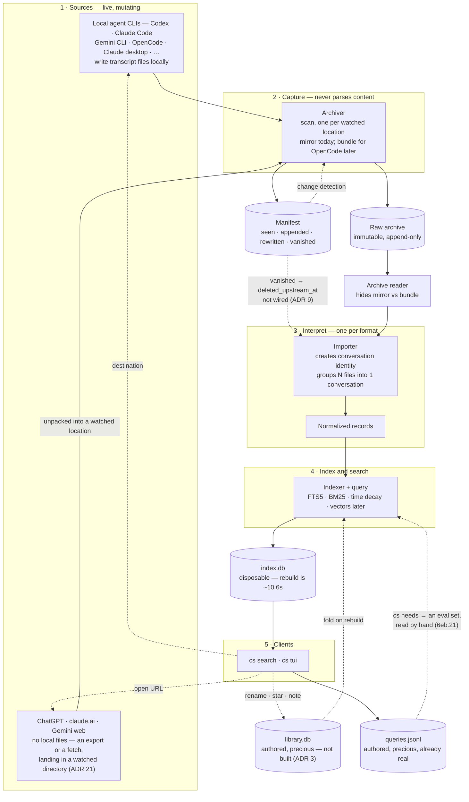
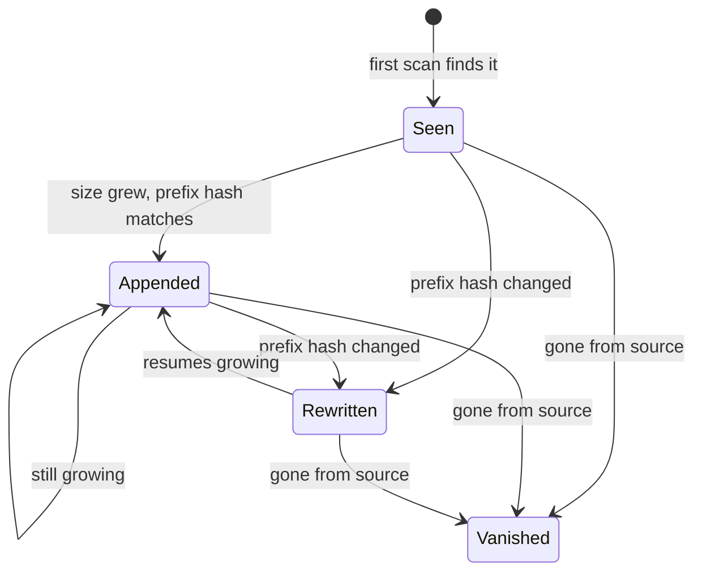

# Architecture (draft)

> **Status: draft, in flux.** A working sketch of how the pieces fit, kept around so the
> shape is easy to discuss and easy to onboard to.
>
> **If you are an agent or a future reader:** where this disagrees with
> [DECISIONS.md](./DECISIONS.md) or [GLOSSARY.md](./GLOSSARY.md), **those win** — several of
> the ADRs drawn here are still `proposed`. Where it disagrees with `crates/`, the code wins,
> and [What exists](#what-exists) is written so you can settle that in one command instead of
> trusting this file.
>
> **Nothing regenerates this document.** It used to claim it was "derived from the decision
> log, the way `index.db` is derived from the archive". That was aspirational — there is no
> generator and no sync step — and the drift it licensed is what left a hand-maintained state
> table wrong in both directions within two days (`chat-search-4ar.5`). What is kept here is
> the part the code cannot state for itself: where the boundaries are, why they sit there, and
> what is deliberately missing.

---

## The flow

The straight line runs source → archive → importer → index → client. Everything worth noticing
is a loop back:

- **Authored data flows back** into the index on every rebuild, which is what keeps `index.db`
  deletable (ADR 1, ADR 3). `library.db` is not built; `queries.jsonl` is the first file of
  that kind and already exists.
- **A destination flows back** to the originating tool, resolved from `(source, native_id)` at
  action time rather than read out of a column (`cs-core/src/destination.rs`). `cs tui` execs
  the agent in place so it inherits the terminal, and prints an `eval`-able line instead
  whenever stdout is not one.
- **The query log flows back into the ranking, by hand.** `cs search`, `cs pick`, `cs abandon`
  and `cs tui` append what was searched for and what was opened. `cs abandon` also records what
  was searched for and *not* opened, which is the only thing the log ever learns that is not a
  success. `cs needs` then folds all of it into one entry per *need* rather than per query
  string, since counting strings counted every keystroke of a slowly typed query as its own
  need (ADR 22). Nothing reads any of this automatically. Converting it into an eval set is
  `6eb.21`, and until then the eval set in `evals/ranking.toml` is written by hand.
- **The manifest feeds change detection and nothing else.** The dotted edge into the importer
  is the fold ADR 9 describes, and it does not exist yet — see "Built in part" under
  [What exists](#what-exists).

`queries.jsonl` is drawn as its own node because it is a third category the picture used to have
no room for. `index.db` is disposable, `library.db` is precious but absent, and this one is
precious, present, and **the only file here that cannot be reconstructed from anything**. The
archive can rebuild the index, and nothing can rebuild a record of what you went looking for.

---

## Components

| | Knows about | Must not know | If it fails | One per |
| --- | --- | --- | --- | --- |
| **Archiver** | paths, sizes, mtimes, hashes, layout policy | JSON structure, what a conversation is | **permanent data loss** | source _location_ |
| **Archive reader** | physical layout (mirror vs bundle) | formats, conversations | rebuild breaks | archive |
| **Importer** | one source's format, lineage, kinds | where bytes came from, machines, capture history | no search — rerun in ~10.6s | source _format_ |
| **Indexer + query** | schema, tokenizer, ranking | source formats | no search — rerun in ~10.6s | project |
| **Clients** | the query contract | everything upstream | no UI | surface |
| **Query log** | what was asked for, what was opened, where it ranked | ranking internals, conversation text | the ranking loses its only real ground truth; **the searches still return** | machine |

Two boundaries carry most of the weight, plus one deliberate exception:

- **Archiver / importer** — the split that makes _retroactive reparse_ possible. Fix an
  importer, rebuild, and every conversation back to the first captured byte gets the
  improvement. Fused, fixes would only ever apply going forward. (ADR 1)
- **Indexer / search are not split.** They share the tokenizer, schema and ranking, and
  splitting them produces silent recall bugs rather than crashes.
- **The query log is allowed to fail.** Every call site drops the error from
  `querylog::append` on purpose: losing a log line costs a data point, failing the search
  costs the thing that was actually asked for. It is the one place here where swallowing an
  error silently is the right call, which is why the rule lives in one function rather than
  being re-decided at each of the four callers.

---

## Why "one chat" is not "one file"

A single Codex conversation from this corpus produced four files, hours apart, each with a
different UUID in its filename:

| file | role | size |
| --- | --- | --- |
| `rollout-…019f199a…` | main thread | 2,961 KB |
| `rollout-…019f1a51-b486…` | subagent (Averroes) | 768 KB |
| `rollout-…019f1a51-cab4…` | subagent (Poincare) | 465 KB |
| `rollout-…019f1ace…` | subagent (Singer) | 239 KB |

Nothing in the filenames or paths links them, because the shared `session_id` is _inside_ the
files. So the archiver cannot group them and does not try. It copies four unrelated files.

**Conversation identity does not exist until stage 3.** This is the clearest illustration of
the division of labour, and the reason the archiver can be finished before any importer works.

---

## File lifecycle

What the archiver records in the manifest for each source file:

- **Appended** is the overwhelmingly common case — copy the newer, longer file over the older
  one. Monotonic, so nothing is lost.
- **Rewritten** means compaction or an in-place edit — preserve the old copy under
  `_superseded/` rather than losing it.
- **Vanished** is designed to fold up into `conversation.deleted_upstream_at` — content kept,
  only the fact of upstream deletion recorded (ADR 9). **The fold is not implemented**: the
  event is written here and nothing downstream reads it. See "Built in part" below.
- **Excluded** is the one classification that is deliberately *not* a manifest state, which is
  why it is absent from the diagram above. It is a file the archive already holds, still on
  disk, that the include list has stopped naming — narrowing a glob is a config edit, not
  something that happened to the file, so nothing is written and the silence rule
  (`recorded_anything` in `cs archive`) is untouched. The scan reports it as standing state,
  in a column of its own, on every run for as long as it is true. Calling it `Vanished`
  instead — which is what the code did until the first narrowing was attempted,
  chat-search-aig — would write "gone from source" about a file anyone can `ls`, permanently,
  into the log ADR 9 folds into the flag that warns reopening will fail.

A file being written _while_ the archiver copies it yields a truncated last line. That is safe
by construction, not by luck: append-only plus supersede-on-next-scan means the partial copy
is replaced. Importers skip unparseable trailing lines.

---

## Cadence and lag

The stages do not run together, so there is always some lag between saying something and
being able to search for it.

| stage | runs |
| --- | --- |
| source writes | continuously, during the conversation |
| archiver | scheduled scan — launchd every 300 s on this machine (BACKLOG, "Operations"); watch for the live session undecided |
| importer + indexer | on rebuild — always full, never incremental (ADR 10). ~10.6s post-clip on the real corpus (ADR 5); the 7s figure quoted elsewhere is the PoC's smaller frozen corpus |
| clients | on demand — in-process for Rust surfaces, ~9 ms end to end for anything spawning `cs search --json` (ADR 14) |

How much lag is acceptable is a UX decision that drives the watch-vs-scan choice. It is not
settled. Worst case today is one scan interval plus a manual rebuild, so a conversation is not
searchable while it is still being had.

---

## What exists

There was a hand-written status table here. It was accurate on 2026-07-28 and wrong in **both**
directions by 2026-07-30: it called the archive reader and every client "not built" while both
were in `crates/`; it filed the Codex and Claude Code importers as PoC code reading live source
directories when all four importers take bytes from the archive reader and touch no filesystem
outside their own corpus tests (ADR 1); it said the index had no DAG and no `head_id` when both
are columns in `schema.rs`; and it pointed at `poc/` — a measurement instrument `Cargo.toml`
explicitly excludes from the workspace — as where the working program lives. The one claim it
got right, "no tombstones", it got right for the wrong reason; see "Built in part" below.

It is gone rather than corrected, because being wrong twice is a property of the form, not of
whoever maintained it. **A status table has no failure mode.** Nothing breaks when it goes
stale, no test reads it, and the reader most likely to trust it — an agent deciding what to
build next — is the one least equipped to notice. What replaces it is split by whether the code
can already answer the question.

### The tree answers "what exists", and it cannot go stale

| question | what answers it |
| --- | --- |
| which components are built | `ls crates/*/src/*.rs` — `cs-archive`, `cs-core`, `cs-import`, `cs-tui`, `cs`, and `Cargo.toml`'s `members` |
| what the tool can do | `cs --help`, then `--help` on any subcommand. Every capability is a subcommand; there is no second entry point |
| which sources are watched, and which are missing from this machine | `cs status` |
| which of them reach the index, and what each contributes | `cs index` — a source that contributes nothing gets a row saying **why**, because a silently missing row is how 2,011 ChatGPT conversations once vanished from a run that reported success (`6eb.7`) |
| whether the ranking is any good | `cs eval run` for the score — `—` rather than a number until the set is judged, which is the honest answer today (`evals/README.md`). `cs needs` for what has actually been searched for |
| whether a specific conversation is findable | `cs explain <conv-id> <query>` |
| what one conversation actually contains | `cs show <conv-id> [query]`. `--json` is the client contract (ADR 12): it carries the fold rules' answers — which messages are drawn, which matches may claim to have ranked it — so a non-Rust reader never re-derives them |

Counts those commands print describe **the last rebuild, not the code**: on 2026-07-30 the
index on this machine held 2,935 conversations across three sources and no `gemini-cli` rows at
all, because the Gemini importer landed after the last `cs index` ran. Rebuild before believing
a count.

### What is deliberately absent

This is the half the tree cannot answer, because an absence has no file to point at. Each row
carries what would falsify it, so a doubtful reader settles it in about a second.

| not built | why | falsified by |
| --- | --- | --- |
| `library.db`, authored events | nothing authored is written yet and the index holds none of it. The ADR 3 invariant is cheap to hold now and unpleasant to retrofit. `queries.jsonl` is the first authored file and sits deliberately outside the index | `grep -rn library.db crates/` — doc comments only, no code |
| Embeddings / vectors | ADR 6 reserves `sqlite-vec` for the same file when embeddings arrive; ADR 1 warns they must be cached outside the rebuild path, or the disposable index stops being disposable | `grep -rn sqlite-vec crates/ Cargo.toml` — nothing |
| OpenCode capture, and any OpenCode importer | bundle layout (ADR 18) is unimplemented, so the configured `opencode` source is skipped by `cs scan` and `cs archive` alike, and `import_source` has no arm for it | `grep -rn "Layout::Bundle" crates/` — skips and a reserved id, no capture path |
| Incremental indexing | ADR 10 — full rebuild is ~10.6s, and patching an FTS index through deletes is where the bugs live | `cs index` builds through `cs_core::IndexBuild` and swaps the finished file in; nothing else in `cs` opens `index.db` for writing |
| A daemon | rejected on measurement 2026-07-29 (ADR 14): ~3 ms of spawn-and-open, against a socket protocol, a lifecycle, and a stale-cache failure mode over a database designed to be deleted | — |
| Raycast, VS Code, menu-bar surfaces | ADR 12's JSON contract exists precisely so these stay a weekend rather than a refactor, and [JSON-CONTRACT.md](./JSON-CONTRACT.md) is what one decodes | `cs --help` lists the surfaces that exist |
| Redaction | ADR 15, still `open`, and it gates anything leaving this machine | — |

### Built in part — the state neither a table nor the code admits to

Six things read as finished from either end and are not. They are here because this is the
only place that can say so: the schema looks complete, the code compiles, and the gap is a
missing edge rather than a missing file.

- **A sitting opens, and nothing says it is one (chat-search-o1i.9).** `cs_core::sittings`
  reads Google's activity log back as the chats it was, so a `cs search` row can stand for
  eleven conversations and reports its counts that way — 1,271 activity records come back as
  462 rows. Opening one used to render the two messages of the record that opened it while the
  row above said twenty-two; `cs show` and `cs explain` now resolve their argument through
  `sittings::resolve` and answer for the same unit the ranker grouped, from any member id
  (chat-search-o1i.8). What is still missing is the *saying so*: no surface draws
  `Group::sitting`, so an eleven-record row looks exactly like a conversation that had eleven
  turns, and the reader is not told the grouping is a heuristic this project applied rather
  than something Google recorded. `cs show` prints a line above the counts; the TUI row and the
  preview pane print nothing. It fails in the safe direction — a reconstruction presented as a
  conversation, which is what it almost always was — but a fold that can be wrong should look
  like one.
- **Tombstones have a reader and no writer (ADR 9).** `conversation.deleted_upstream_at` is in
  the schema, `search.rs` selects it in four places, and `cs search` renders a
  `deleted-upstream` flag from it in both its flat and grouped output. Nothing ever sets it.
  The archiver writes `vanished` events into the manifest, and **no stage downstream of capture
  reads the manifest at all**, so the fold ADR 9 describes has nowhere to happen.
  `grep -rn deleted_upstream crates/` returns selects, renders and test fixtures, and not one
  write. On this machine the column is non-null for 0 of 2,935 conversations, which is
  indistinguishable from "nothing has vanished yet", and that is the failure mode. When a
  source file does disappear, the archive keeps the content and the search says nothing, so
  reopening fails at the one moment the flag existed to warn about.
- **Exports are configured sources, not detected ones.** Every id in the archiver's candidate
  list is a directory some running agent writes to, and detection is `path.is_dir()` over that
  list. An export is not written by anything — it is mailed, downloaded and unpacked wherever
  you happen to put it — so `chatgpt-export` cannot be detected and is not in the list
  (`grep -n chatgpt crates/cs-archive/src/config.rs` returns nothing). The importer, the source
  id and its permanence (ADR 16) are all real; the `[[sources]]` block stays hand-written, and
  `google-takeout` (chat-search-o1i) is the second source of that shape. What used to follow —
  `cs init` on a second machine writing a config **silently** missing 69% of this corpus — no
  longer does. `cs_archive::unreachable::SERVER_SIDE` states the three surfaces no detection can
  reach, `cs init` names them as it writes the config, and `cs archive` says it again once a day,
  with the recommended `[[sources]]` blocks, until each one is configured (chat-search-a7k.22).
  The gap is still a gap: it is a stated list rather than a discovered one, so a fourth surface
  is invisible until somebody adds it, and `claude-ai` is named without a block because no export
  of that shape has been seen here. What changed is that the omission announces itself.
  The same asymmetry decides what `cs init` may do to a config that already exists. `--force`
  used to save a fresh `Config::default()` over it, which deleted both blocks above and the
  comments beside them and said nothing; it now compares first and refuses unless re-running
  detection would put back everything the file holds (`cs_archive::overwrite`,
  chat-search-a7k.30). So it adds what has appeared since and never removes what it cannot
  find, and regenerating an edited config is a `mv` somebody types.
  **This paragraph is load-bearing.** `cs-archive`'s staleness nag (chat-search-a7k.10) derives
  "export-shaped" from exactly this — absence from the candidate list — so adding an export id
  to `candidate_sources()` would silently switch its nag off rather than fail, and would also
  make the same id both a candidate and an unreachable surface.
  `staleness::the_real_candidate_list_classifies_the_two_export_sources_it_ships_with` and
  `unreachable::no_server_side_surface_is_also_a_detectable_candidate` are the two tests that
  turn that from a silence into a failure.
- **Compressed Codex rollouts are captured and cannot be read.** The `codex` source globs
  `**/rollout-*.jsonl.zst` as well as `.jsonl`, because Codex zstd-compresses rollouts older
  than about a week and everything older would otherwise stop being captured. Capture stores
  either verbatim and calls decompression the importer's problem — and no importer solves it:
  `grep -rn zstd crates/*/Cargo.toml Cargo.toml` finds no dependency, so `codex::import` would
  see compressed bytes, parse no lines, and return `None` — the same signal an empty rollout
  gives. Nothing is lost yet: the archive holds 692 rollouts and no `.zst` at all. When the
  first compressed one lands it will be captured correctly and read as an empty conversation,
  which is a silent miss, not an error.
- **Nothing can take bytes back out of the archive (ADR 9).** A deliberate `forget` is
  specified — remove from raw and index, write a tombstone so the next scan cannot resurrect it
  from a source file that still exists — and there is no implementation: `grep -rn forget
  crates/ --include='*.rs'` finds two unrelated test names and one comment in `answer.rs`
  calling `deleted_upstream_at` "the tombstone a forget leaves". No command, no code path, no
  tombstone. So capture is one-way, and a glob that was too wide is only half reversible. Narrowing it stops the next byte; the ones already taken stay. The live example is
  the one that produced this bullet: 175.5 MiB of `gemini-cli` checkpoints, captured under
  `**/*.json` before it became `**/chats/*.json` (chat-search-aig), still sitting in
  `raw/<machine>/gemini-cli/*/checkpoints/`. Deleting them by hand is not the missing feature —
  it is the thing the missing feature exists to prevent, because the manifest would go on
  claiming the archive holds files it no longer has, and nothing anywhere would record that a
  human removed them. They are clones sharing blocks with files still under `~/.gemini/tmp`
  (ADR 20), so today they cost almost nothing and they are recoverable from the source; the day
  Gemini prunes its own checkpoints, both of those stop being true.
- **Superseded copies have a writer and no reader.** On a `Rewritten` change the archiver moves
  the old copy to `_superseded/<source_id>/<rel_path>.<ts_ms>` rather than overwriting it, which
  reads as "the previous version is kept". It is kept on disk and it is unreachable:
  `ArchiveReader::files()` walks `<machine_dir>/<source_id>`, and `_superseded` is a *sibling* of
  those directories, not a child. `grep -rn _superseded crates --include='*.rs'` returns
  `capture.rs` and its tests — one writer, no reader, nothing in `cs-import` or `cs`. Nothing is
  lost yet because no source here has been rewritten (`ls ~/.chat-archive/raw/*/_superseded`
  finds no such directory). It matters prospectively: ADR 21's fetchers write whole-account
  snapshots, and one that wrote to a stable path would park each previous snapshot here and
  silently drop it out of the index. That is why ADR 21 requires a unique path per run.

### What would keep this honest

Not much, and it is worth being blunt about that: **none of the above is enforced.** A sentence
in a Markdown file cannot fail a build. What the section buys instead is a cost change. Every
claim is one command away from being checked, so the effort of verifying is smaller than the
effort of wondering, and lowering that cost is about all a document can do.

The two claims that deserve promotion out of prose and into `crates/` are the ADR 3 invariant
(no authored column reachable in `index.db`) and the tombstone writer, since both are testable
and both are currently held by nothing but attention. If a future reader finds this section
stale, the fix is to delete the row rather than to re-sync the file — anything that needs a
sync ritual to stay true has already failed once here.

---

## Open questions that would redraw this

| # | question | affects |
| --- | --- | --- |
| ADR 16 | Is `codex_work_desktop` a separate source? Cannot be retrofitted — it changes conversation ids | source list, archive layout |
| ADR 17 | Machine re-keying after a clone or restore | archive namespacing |
| ADR 18 | Sync raw at all, or keep per-machine archives and merge only `library.db`? | whether the archive is a sync unit |
| ADR 19 | Prefix hash vs full-file hash | scan cost, rewrite detection |
| ADR 20 | Compress per-file or per-bundle, and when. APFS cloning is decided and running; compression is the open half | capture strategy; clone vs compress is exclusive per copy |
| ADR 15 | Redact at capture or at display | whether the archiver is destructive |
| — | Watch vs scan, and acceptable lag | archiver design |

**ADR 14 came off this list on 2026-07-29** — no daemon, decided against measurement rather
than taste. That is why the TUI is a subcommand linking `cs-core` in-process instead of a
client talking to a resident process, and why "no index yet" and "index being rebuilt" are
states every client has to render rather than transport errors it can ignore.

---

## Reading order

1. [GLOSSARY.md](./GLOSSARY.md) — vocabulary. Four different things look like "branching", and they are not interchangeable.
2. [DECISIONS.md](./DECISIONS.md) — what was decided and why, with status.
3. [../poc/RESULTS.md](../poc/RESULTS.md) — measurements, and the three bugs differential testing caught. A settled language question (ADR 13), not a foundation; the product lives in `crates/`.
4. This document — the shape it all adds up to, provisionally.
5. [INGESTION.html](./INGESTION.html) — the same path walked stage by stage against measured numbers: source coverage, per-source proportion of the index, and where the 317 MiB goes. Open in a browser.
6. [TUI-DESIGN.md](./TUI-DESIGN.md) — the one client with a written spec, including what was rejected from the tool it was read against.
7. [BACKLOG.md](./BACKLOG.md) — framing, MVP scope and live operational state; the work itself is in beads (`bd ready`).
